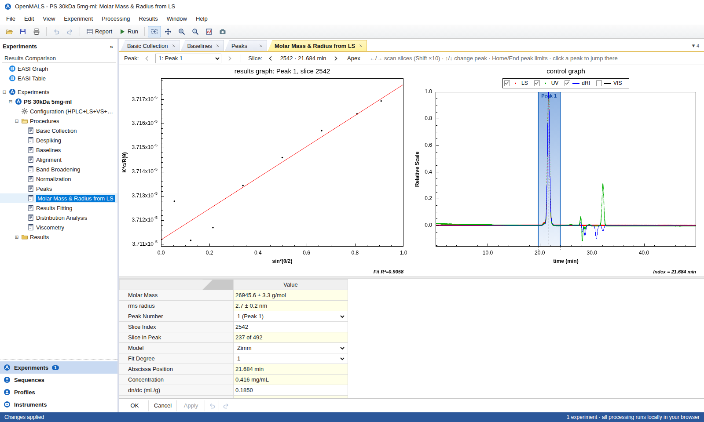

# OpenMALS

**Open-source, browser-based SEC-MALS / GPC light scattering data analysis: an open alternative for analysing Wyatt ASTRA experiments.**

OpenMALS opens ASTRA `.afe8` experiment files directly in the browser. It reproduces the ASTRA
data-analysis workflow and looks and feels like the desktop application. There is no server and
no installation: files are read and processed locally and never leave your computer.



## Features

| ASTRA procedure / view            | OpenMALS                                                                                         |
| --------------------------------- | ------------------------------------------------------------------------------------------------ |
| Basic Collection                  | Every collected signal: LS detectors, UV channels, dRI, viscometer, forward monitor and HPLC pressure/flow. Legend check boxes and independent axes, as in ASTRA. |
| Despiking                         | Hampel spike filter with Low / Normal / High levels.                                             |
| Baselines                         | Per-signal baselines, one signal on screen at a time (switch with the list or ↑/↓). Drag on the graph to set the range, drag the end points, use Snap-Y or Manual style, Autofind or Set All. |
| Alignment                         | Interdetector volumes measured from a narrow standard, or entered by hand.                      |
| Band Broadening                   | Fits a Gaussian (instrumental) and exponential (mixing) term per instrument against the RI peak. |
| Normalization                     | Detector normalization coefficients from an isotropic scatterer, with optional radius correction. |
| Peaks                             | Drag on the graph to add a peak, drag its edges to adjust, or use Autofind. Click a peak or its number to select it; Delete removes it. Per peak: dn/dc, UV extinction, A2, injected mass, LS model and fit degree. |
| Molar Mass & Radius from LS       | Per-slice Zimm / Debye / Berry fits of degree 1 to 3. Live Debye plot; scan slices with ←/→ and switch peaks with ↑/↓ or a click. Enable or disable detectors. |
| Results Fitting                   | Polynomial or exponential fits of molar mass or rms radius against time.                        |
| Distribution Analysis             | Cumulative and differential weight fractions on linear or log axes, with ranges drawn on the graph. |
| Viscometry                        | Intrinsic viscosity per slice (dilute or Solomon–Ciuta), hydrodynamic radius and the Mark–Houwink plot. |
| Results                           | Printable report and peak results with uncertainties. Also: peak statistics (plates, asymmetry, tailing), slice table, molar mass vs time, conformation plot, the results ASTRA stored in the file, the experiment log and the file contents. |
| EASI Graph / EASI Table           | Overlay and tabulate several experiments.                                                       |
| Methods                           | Save the processing parameters as JSON and apply them to other experiments.                     |
| Export                            | CSV for results, slices and processed signals; PNG of any graph (right-click a graph); print or save the report as PDF. |

Supported data: DAWN / HELEOS / miniDAWN multi-angle light scattering, Optilab refractometers,
HPLC UV detectors (multi-channel), viscometers on LS auxiliary inputs, and HPLC pump traces. Every
instrument keeps its own time base.

Instrument control and data collection are out of scope; this is a data analysis tool.

## Quick start

```bash
npm install
npm run dev          # http://localhost:5173
```

On Windows you can double-click `start.bat` instead. It installs the dependencies on first run,
starts the dev server and opens the browser.

Click **Open sample (PS 30 kDa)**, or drag `.afe8` files onto the window.

```bash
npm test             # unit + validation tests (vitest)
npm run build        # static site in dist/
```

`dist/` is a fully static site that can be served from anywhere: GitHub Pages, an intranet web
server, or a file share served over HTTP. `.github/workflows/pages.yml` publishes it to GitHub
Pages on every push to `main`. To turn it on, go to *Settings → Pages → Source: GitHub Actions*.

## Using it

The screen is laid out like ASTRA:

* **Experiments tree** (left): Configuration, Procedures and Results for every open experiment, plus EASI Graph / EASI Table at the top.
  Drag its right edge to make it wider or narrower.
* **Document tabs**: each procedure has a graph, a property grid and **OK / Cancel / Apply**. Edits are drafts until they are applied,
  and every edit can be undone (Ctrl+Z / Ctrl+Y). Right-click a tab to close others; the ▾ button lists every open view.
* **Graphs**:
  * Drag to zoom, double-click to autoscale, wheel to zoom the time axis (Ctrl+wheel for the y axis).
  * In Peaks, Baselines and Distribution a plain drag draws a range; pick **Zoom** or **Pan** in the view's tool strip to navigate.
  * Click a legend box to show or hide a signal.
  * Right-click to save an image or export the data.
* **Toolbar**: undo/redo, zoom/pan mode, zoom in/out, autoscale, save image, report, run.
* **Keyboard**: see *Help → Keyboard Shortcuts* (F1).

A typical calibration workflow on a narrow standard such as BSA or PS:
1. Check the Baselines.
2. Run **Alignment**, then **Band Broadening**, then **Normalization** on the standard.
3. Save the method and apply it to your samples.

## Validation

* **Synthetic data** (`tests/synthetic.test.ts`): data generated with a known M(t), rg(t) and [η](M) are recovered exactly.
  * Zimm recovers M, rg, Mn, Mw, Mz, mass recovery, the conformation slope and Mark–Houwink K and a.
  * Debye and Berry are tested within their known model errors for large coils.
* **The bundled PS 30 kDa experiment** (`tests/pipeline.test.ts`):
  * The baselines (Snap-Y) and peak areas match the values ASTRA stored in the file.
  * After alignment and normalization the standard gives Mw ≈ 26.4 kDa, Mw/Mn ≈ 1.01, rz ≈ 4.4 nm, [η]w ≈ 26.8 mL/g and Rh ≈ 4.8 nm.
  * The UV extinction at 254 nm comes out at 1.55 mL/(mg·cm).

See [docs/VALIDATION.md](docs/VALIDATION.md) for the details and for one notable difference from the
numbers ASTRA saved in that file.

## Documentation

* [docs/AFE8_FORMAT.md](docs/AFE8_FORMAT.md): the `.afe8` file format, as reverse-engineered for this project.
* [docs/THEORY.md](docs/THEORY.md): equations and algorithms used by every procedure.
* [docs/VALIDATION.md](docs/VALIDATION.md): validation against synthetic data and ASTRA.
* In the app, *Help → About OpenMALS / User Guide*.

## Project layout

```
src/afe8/       .afe8 reader: gzip + SQLite (sql.js/WebAssembly), BLOB decoding, experiment model
src/analysis/   science: despiking, baselines, alignment, band broadening, normalization,
                light scattering fits, moments, distributions, results fitting, viscometry,
                peak statistics
src/chart/      dependency-free canvas chart in the ASTRA style
src/ui/         application shell, property grid, view frame
src/views/      one component per procedure / results view
tests/          vitest suites (sample file + synthetic ground truth)
e2e/            Playwright screenshot script used during development
Astra Examples/ example experiment and ASTRA screenshots used as the reference
```

## License

MIT. ASTRA, DAWN, Optilab and ViscoStar are trademarks of Wyatt Technology Corporation. OpenMALS is
an independent project and is not affiliated with or endorsed by Wyatt.
